# Boilerexams Frontend Application Project

## The chosen solution to my take-home assignment: Problem 4- creating a course page

### Home page

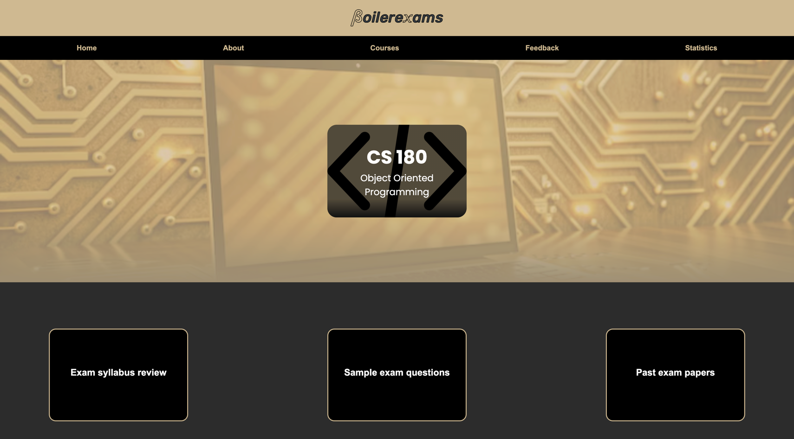

The image above is a screenshot of the home page of the chosen course (CS 180- this course isn't available on 
boilerexams yet so most of the content in it is mainly just dummy content).
Clicking on anything in the main menu for now just leads to the actual pages on the actual boilerexams site. For instance, 
clicking on "About" in the main menu just leads to the "About" page of the actual boilerexams site. However, clicking on
"Home" just leads you back to this home page of the course.
Then you just have a card displaying the course name, and three buttons, whose functionalities we'll be exploring further
down this README.

### Exam syllabus review

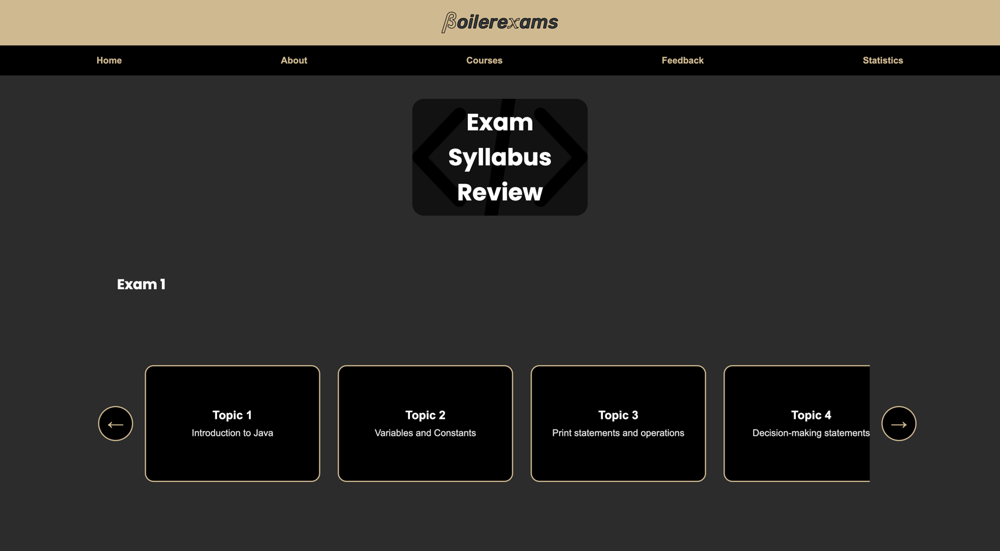
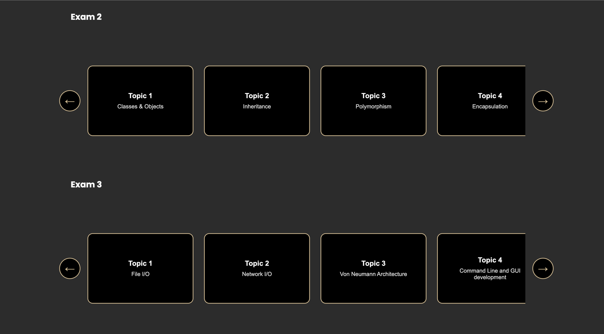

This page is supposed to be an area that centralizes the storage of all the notes used in class by professors and TAs, to 
revise for the respective exams.
Below the name card are a series of sliders named "Exam 1", "Exam 2" and "Exam 3", and a series of buttons in the slider 
named after several topics in the CS 180 syllabus. For now, only Exam 1 Topic 1 is clickable and leads to a page when clicked.
The other buttons exist only for display purposes.

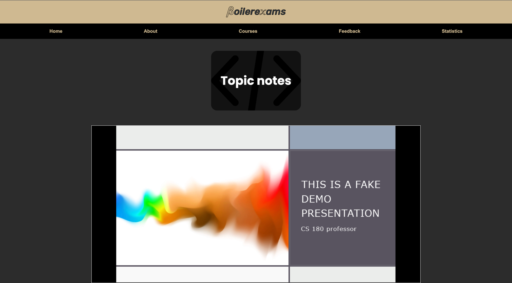
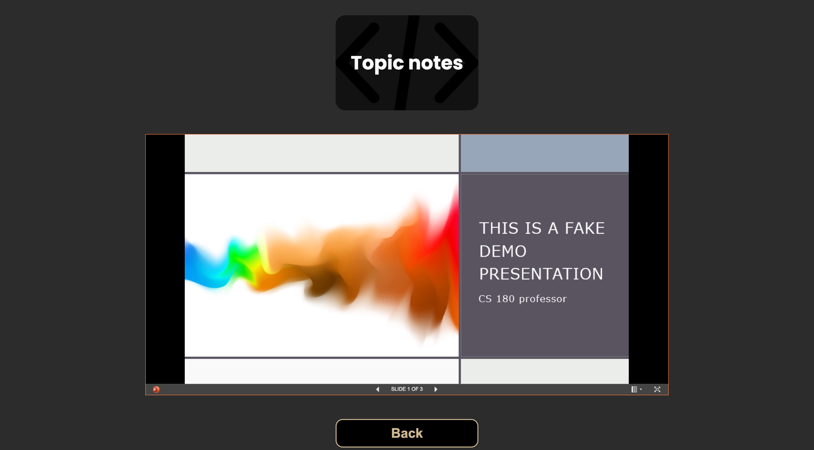

The above images is what clicking on the Exam 1 Topic 1 directs the user to. It essentially contains a power-point viewer to
a fake presentation, but should be a container for actual power-point notes to the actual topic. The back button at the bottom
brings you back to the Exam Syllabus review page to explore other topics. 

### Sample questions by exam

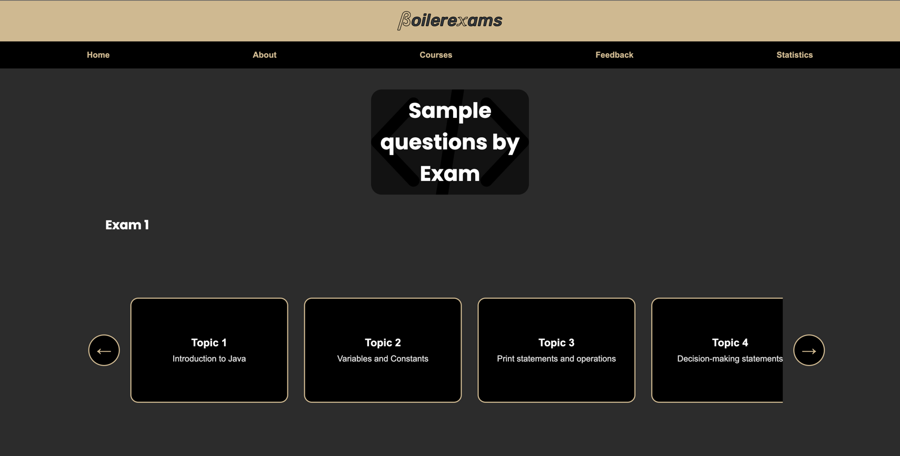
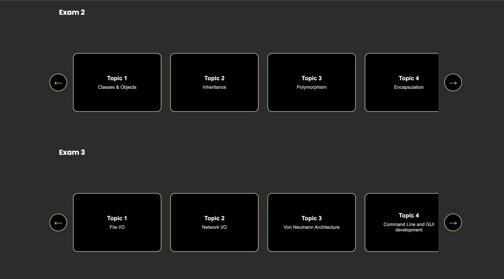

The layout of this page is pretty much the same as the layout of the exam syllabus. And similar to syllabus page, only the 
Exam 1 Topic 1 button is clickable and directs the user to a page when clicked.

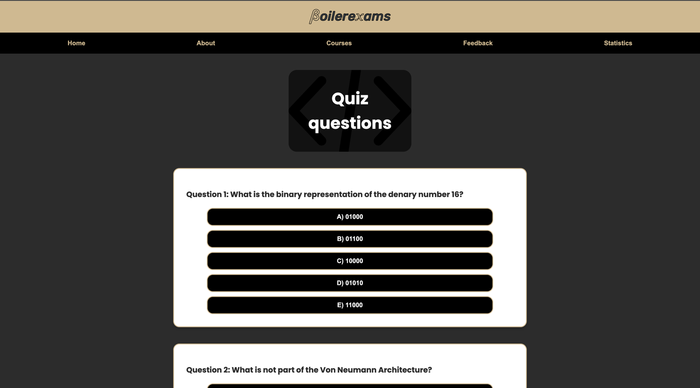
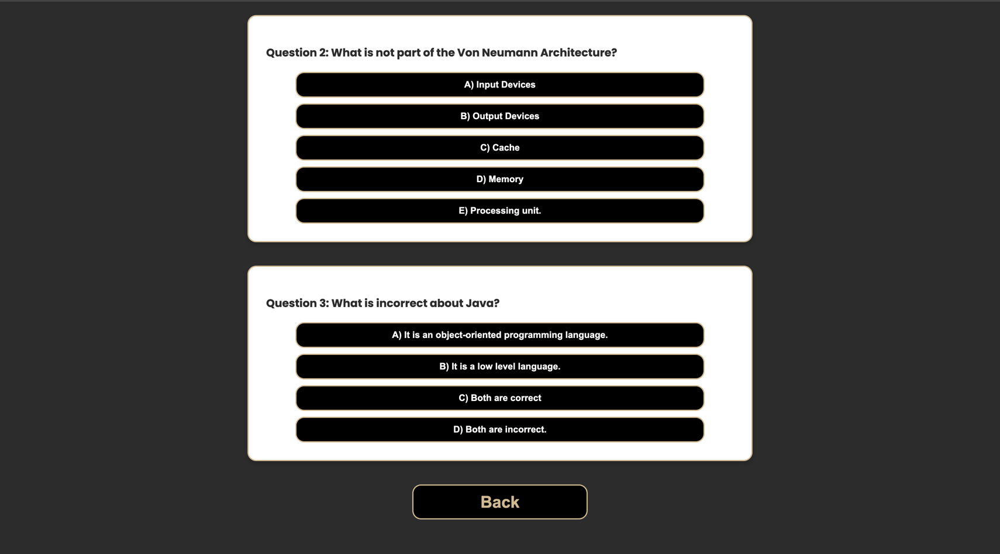

The images above is what the user is redirected to after clicking on Exam 1 Topic 1. This is a mock quiz for one of the 
topics. When the right answer to a question is clicked, the option turns green and the other options are disabled. When
a wrong answer is clicked, the option is highlighted red, the right answer is highlighted green, and the rest of the options
are disabled.

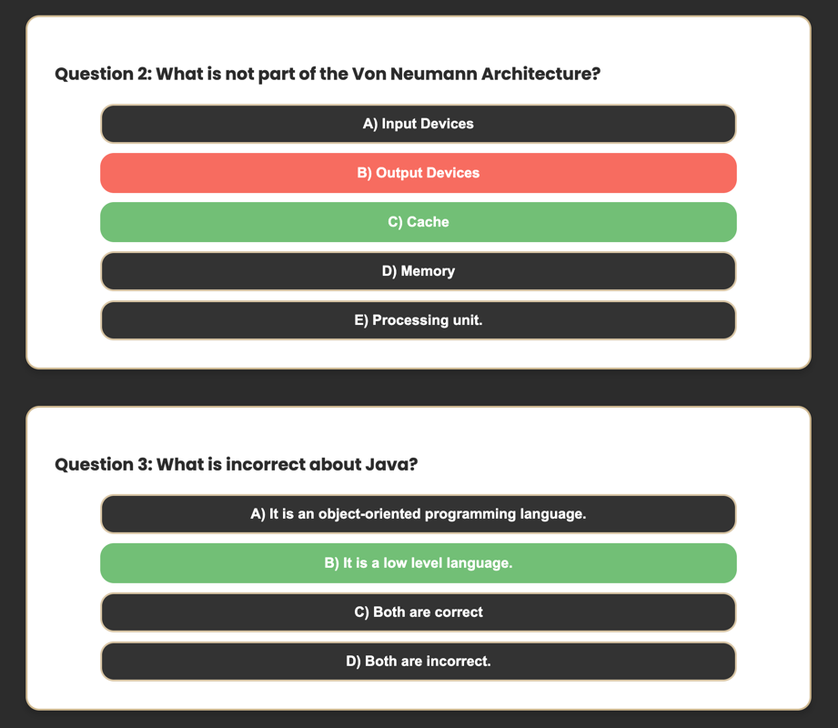

The back button redirects the user back to the Sample Questions page to explore more such quizzes.

### Past exams

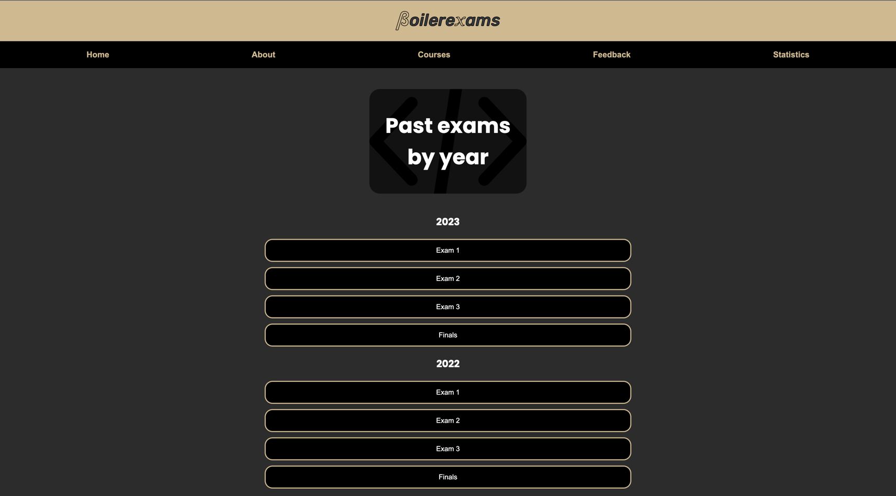
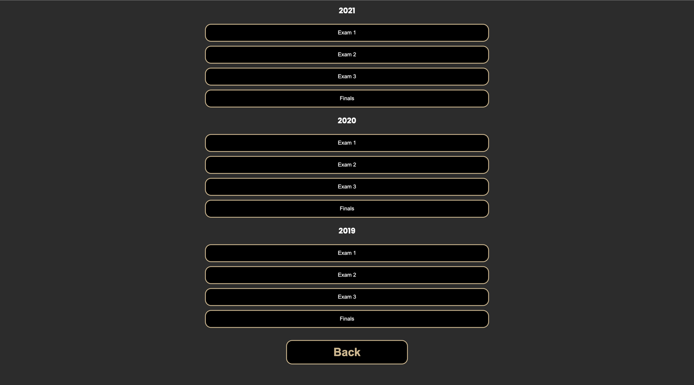

The above images are screenshots of the past exams page. Only Exam 1 of the 2023 section is clickable. Once clicked, it leads
to a PDF of a CS 180 paper from 2008 for now, since I couldn't find a 2023 exam paper online. This was done purely for 
demo purposes only. Similarly, the back button leads you to the home page of the course.